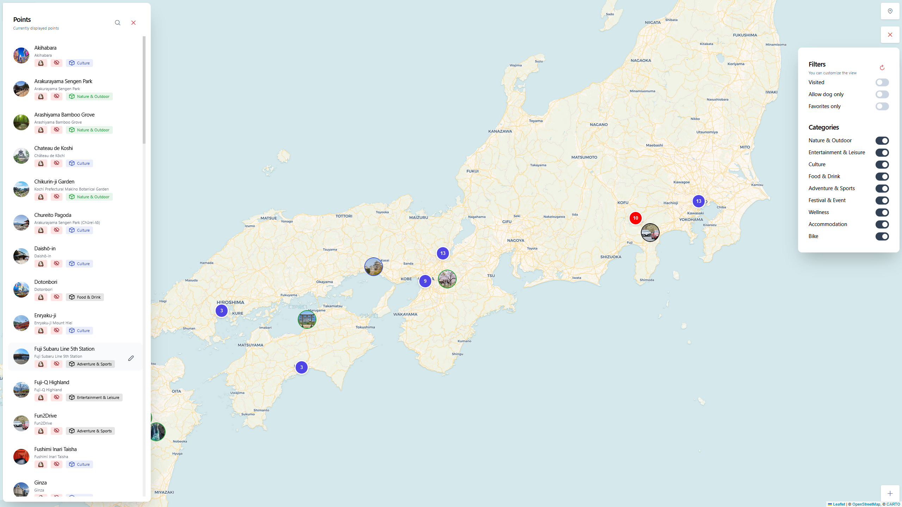
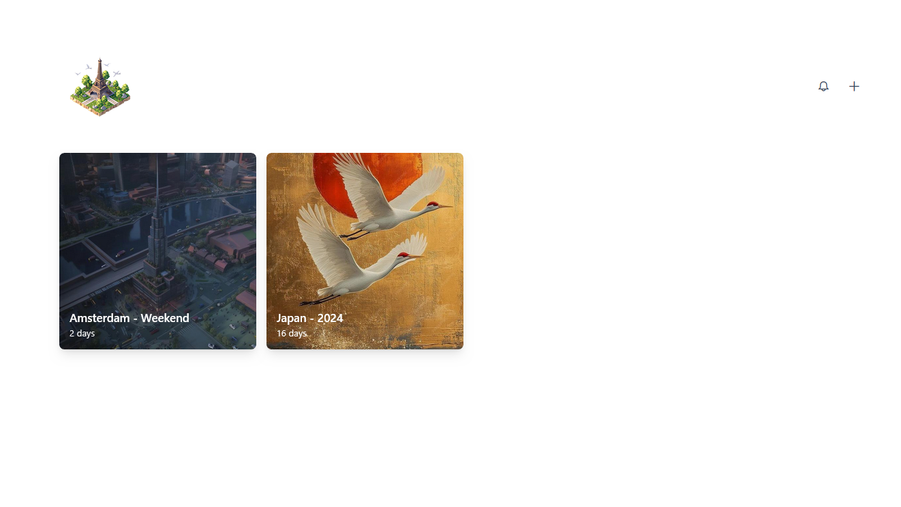

<p align="center"></p>
<h2 align="center">TRIP</h2>

<div align="center">


[](https://github.com/itskovacs/trip/issues)
[](/LICENSE)

</div>

<p align="center">🗺️ Tourism and Recreational Interest Points </p>
<br>

<div align="center">


</div>

## 📝 Table of Contents

- 📦 [About](#about)
- 🌱 [Getting Started](#getting_started)
- 📸 [Demo](#Demo)
- 🚧 [Roadmap](#Roadmap)
- 📜 [License](#License)
- 🤝 [Contributing](#Contributing)
- 🛠️ [Tech Stack](#techstack)

## 📦 About <a name = "about"></a>

TRIP is a minimalist Map tracker and Trip planner to visualize your points of interest (POI) and organize your next adventure details.

Demo is worth a thousand words, head to 📸 [Demo](#Demo).  

🔒 Privacy-First – No telemetry, no tracking, fully self-hostable. You own your data. Inspect, modify, and contribute freely.

<br>

## 🌱 Getting Started <a name = "getting_started"></a>

If you need help, feel free to open an [issue](https://github.com/itskovacs/trip/issues).

> [!CAUTION]
> :boom: change on Docker volume. If you come from `<1.5.0`, follow the [few steps](https://github.com/itskovacs/trip/releases/tag/1.5.0) to migrate your data.

```bash
# Ensure you have the latest image
docker pull ghcr.io/itskovacs/trip:1

# Run the container
docker run -p 8080:8000 -v ./storage:/app/storage ghcr.io/itskovacs/trip:1
```

If you want to configure OIDC authentication or other settings, see [config docs](https://github.com/itskovacs/trip/tree/main/docs/config.md).

<br>

## 📸 Demo <a name = "demo"></a>

A demo is available at [itskovacs-trip.netlify.app](https://itskovacs-trip.netlify.app/).

<div align="center">

|         |         |
|:-------:|:-------:|
|  |  |
|  |  |

</div>

<br>

## 🚧 Roadmap <a name = "roadmap"></a>

New features coming soon<sup>TM</sup>, check out the development plan in the [Roadmap Wiki](https://github.com/itskovacs/trip/wiki/Roadmap).  
If you have ideas 💡, feel free to open an issue.

If you want to develop new feature, feel free to open a pull request (see [🤝 Contributing](#contributing)).

<br>

## 📜 License <a name = "license"></a>

I decided to license trip under the **CC BY-NC-SA 4.0**. You may use, modify, and share freely with attribution, but **commercial use is strictly prohibited**.

<br>

## 🤝 Contributing <a name = "contributing"></a>

Contributions are welcome! Feel free to open issues if you find bugs and pull requests for your new features!

1. Fork the repo
2. Create a new branch (`my-new-trip-feature`)
3. Commit changes
4. Open a pull request

<br>

## 🛠️ Tech Stack <a name = "techstack"></a>

### **Frontend**

- 🅰️ Angular 19
- 🏗️ PrimeNG 19
- 🎨 Tailwind CSS 4
- 🗺️ Leaflet 1.9 (plugins: [Leaflet.markercluster](https://github.com/Leaflet/Leaflet.markercluster), [Leaflet.contextmenu](https://github.com/aratcliffe/Leaflet.contextmenu))

### **Backend**

- 🐍 FastAPI, SQLModel
- 🗃️ SQLite

<br>


<div align="center">

If you like TRIP, consider giving it a **star** ⭐!  
Made with ❤️ in BZH  

<a href='https://ko-fi.com/itskovacs' target='_blank'></a>  
</div>
