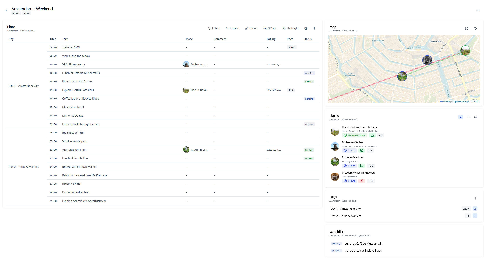

<p align="center"></p>
<h2 align="center">TRIP</h2>

<div align="center">


[](https://github.com/itskovacs/trip/issues)
[](/LICENSE)

</div>

<p align="center">🗺️ Tourism and Recreational Interest Points </p>
<br>

<div align="center">


</div>

## 📝 Table of Contents

- 📦 [About](#about)
- 🌱 [Getting Started](#getting_started)
- 📸 [Demo](#Demo)
- 🚧 [Roadmap](#Roadmap)
- 📜 [License](#License)
- 🤝 [Contributing](#Contributing)
- 🛠️ [Tech Stack](#techstack)
- ✍️ [Authors](#authors)

## 📦 About <a name = "about"></a>

TRIP is a minimalist Map tracker and Trip planner, to visualize your points of interest (POI) and organize your next adventure details.

- 📍 Manage your POI on a Map
- 🐾 Specify metadata (*dog-friendly*, *cost*, *duration*)
- 🗂️ Categorize your points
- 🧾 Plan your next trip in a structured table, *Google Sheets*-style
- 🔍 Use map filtering and searching for fast interactions
- ⚙️ Customize your settings, import/export your data, and more

Demo is worth a thousand words, head to 📸 [Demo](#Demo).  

🔒 Privacy-First – No telemetry, no tracking, fully self-hostable. You own your data. Inspect, modify, and contribute freely.

<br>

## 🌱 Getting Started <a name = "getting_started"></a>

These steps will guide to deploy the app, ready to use in ⏱️ minutes.  
If you need help, feel free to open an [issue](https://github.com/itskovacs/trip/issues).

> [!NOTE]
> Packages are available in the [packages section](https://github.com/itskovacs/trip/pkgs/container/trip) of the repository for quickstart, using just `docker pull`

```bash
docker run -p 8080:8000 -v ./storage:/app/storage ghcr.io/itskovacs/itskovacs/trip:1.0.0
```


### Preparation

Clone the repo, you're one step away from being all set

```bash
git clone https://github.com/itskovacs/trip.git
cd trip
```

### Docker 🐳 (recommended)

If needed, edit `docker-compose.yml` to modify the mapped port (default is `127.0.0.1:8080`).

Run the container, head to TRIP website, create an account, enjoy ✅

```bash
docker compose up -d
```

<br>

### Serving the content
You can serve TRIP using a web server, eg: Nginx
```nginx
server {
    listen 443 ssl;
    listen [::]:443 ssl;

    server_name trip.lan; # Your TRIP domain

    location / {
        proxy_pass http://localhost:8080; # TRIP port, default is 8080
        proxy_set_header Host               $host;
        proxy_set_header X-Real-IP          $remote_addr;
        proxy_set_header X-Forwarded-For    $proxy_add_x_forwarded_for;
        proxy_set_header X-Forwarded-Proto  $scheme;
        proxy_set_header Upgrade            $http_upgrade;
        proxy_set_header Connection         "upgrade";
    }
}
```


### Sources 👩‍💻

Install from sources and run the backend.
Build the frontend and serve it with the web server.

**backend**

```bash
cd backend

# Source virtual environment
python -m venv venv
source venv/bin/activate

# Install dependencies
pip install -r trip/requirements.txt

# Run the backend, port :8000
fastapi run trip/main.py
```

**frontend**

```bash
cd frontend

# Install dependencies
npm install

# Build the frontend
npm build

# Copy the build to your static web server directory
cp -r dist/trip/browser /var/www/html
```

<br>

## 📸 Demo <a name = "demo"></a>

A demo is available at [itskovacs-trip.netlify.app](https://itskovacs-trip.netlify.app/).

<div align="center">

|         |         |
|:-------:|:-------:|
|  |  |
|  |  |

</div>

<br>

## 🚧 Roadmap <a name = "roadmap"></a>

New features coming soon<sup>TM</sup>, check out the development plan in the [Roadmap Wiki](https://github.com/itskovacs/trip/wiki/Roadmap). If you have ideas 💡, feel free to open an issue.

If you want to develop new feature, feel free to open a pull request (see [🤝 Contributing](#contributing)).

<br>

## 📜 License <a name = "license"></a>

I decided to license trip under the **CC BY-NC-SA 4.0** – You may use, modify, and share freely with attribution, but **commercial use is prohibited**.

<br>

## 🤝 Contributing <a name = "contributing"></a>

Contributions are welcome! Feel free to open issues if you find bugs and pull requests for your new features!

1. Fork the repo
2. Create a new branch (`my-new-trip-feature`)
3. Commit changes
4. Open a pull request

<br>

## 🛠️ Tech Stack <a name = "techstack"></a>

### **Frontend**

- 🅰️ Angular 19
- 🏗️ PrimeNG 19
- 🎨 Tailwind CSS 4
- 🗺️ Leaflet 1.9 (plugins: [Leaflet.markercluster](https://github.com/Leaflet/Leaflet.markercluster), [Leaflet.contextmenu](https://github.com/aratcliffe/Leaflet.contextmenu))

### **Backend**

- 🐍 FastAPI, SQLModel
- 🗃️ SQLite

<br>

## ✍️ Authors <a name = "authors"></a>

- [@itskovacs](https://github.com/itskovacs)

<br>

<div align="center">

If you like TRIP, consider giving it a **star** ⭐!  
Made with ❤️ in BZH

</div>
